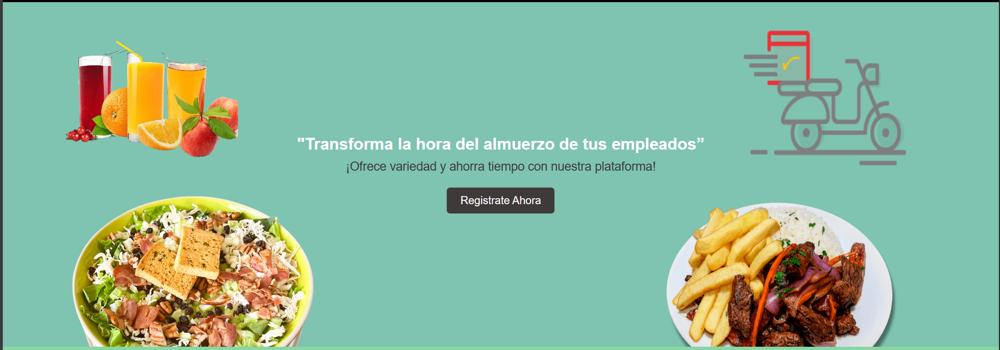
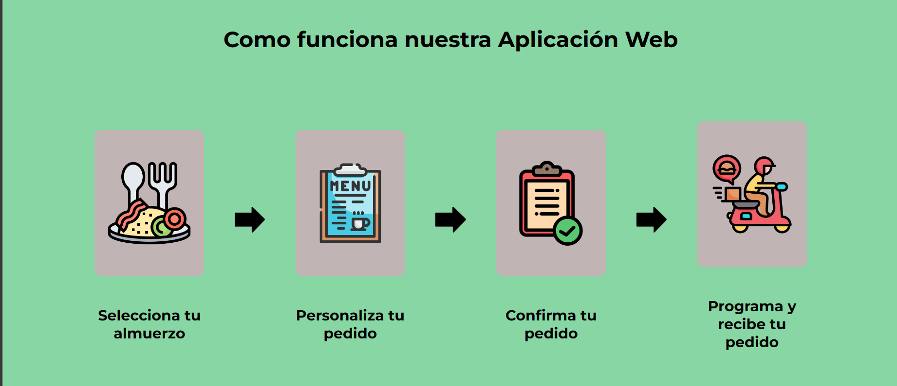
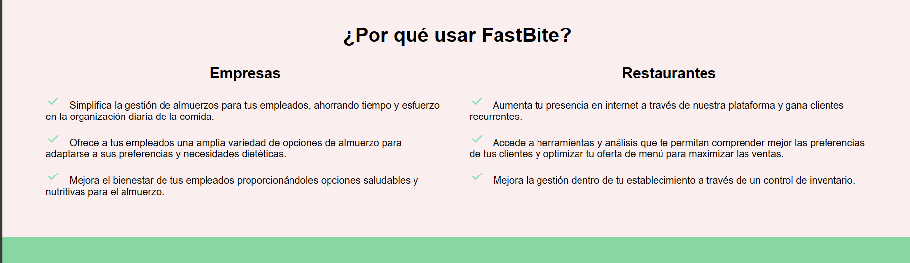
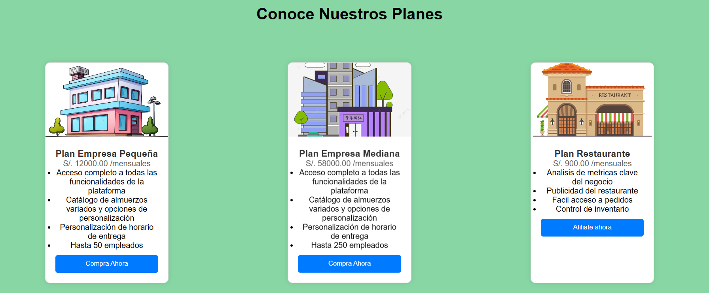

## Chapter V: Product Implementation, Validation & Deployment
----
## 5.1. Software Configuration Management.

## 5.1.1. Software Development Environment Configuration.
En este apartado se indicará los nombres de todos los productos de software a utilizar durante el desarrollo del proyecto, así como las rutas de referencia o descarga de estas. 

Para ello, se organizará la información considerando el tipo de actividades realizadas durante el ciclo de vida del proyecto, siendo la estructura de esta forma:

**Project Management**

* **Scrum Framework:** Este es un marco de trabajo para gestionar proyectos enfocados en el desarrollo ágil de productos software. Implementar este framework en nuestro proyecto nos ayudará a coordinar eficientemente el trabajo en equipo. Puedes obtener más información sobre Scrum mediante [este enlace](https://aws.amazon.com/es/what-is/scrum/).

**Requirements Management**

* **Pivotal Tracker:** Esta es una herramienta online que nos permite gestionar fácilmente nuestras historias de usuarios, mediante la creación de Epics. Además, nos permitió desarrollar el Product Backlog asignando puntos de priorización de cada historia de usuario, para que durante el desarrollo de la aplicación, nos enfoquemos primero en las mejor puntuadas y dejar las más sencillas para el final. Puedes utilizar la herramienta Pivotal Tracker mediante [este enlace](https://www.pivotaltracker.com).

**Product UX/UI Design**

* **UXpressia:** Esta es una plataforma digital que nos ofrece plantillas para crear artefactos de nuestros segmentos objetivos como User Personas, Empathy Maps, Impact Maps y Journey Maps. Puedes utilizar las herramientas que ofrece UXpressia mediante [este enlace](https://uxpressia.com).

* **Miro**: Esta es una plataforma digital que ofrece un entorno para realizar trabajos colaborativos, como lluvia de ideas, tablas y diagramas. Se utilizó esta plataforma para diseñar los cuadros As-Is y To-Be Scenary Map de nuestros segmentos objetivos. Para acceder a las herramientas que ofrece Miro [este enlace](https://miro.com/es/).

* **Figma**: Esta es una herramienta online que ofrece el servicio de maquetación y prototipado de Landing pages,  aplicaciones web, móviles y de escritorio. Esto nos permite tener una estimación de cómo debería funcionar nuestro proyecto. Puedes acceder al servicio que ofrece Figma mediante [este enlace](https://www.figma.com).

* **LucidChart:** Esta es una herramienta de diagramación online que nos permite trabajar colaborativamente en tiempo real. La herramienta ofrece plantillas para crear diagramas de flujo, diagramas UML, etc. En nuestro caso, utilizamos esta herramienta para realizar los Wireflow Diagrams y Userflow Diagrams. Puedes utilizar la herramienta LucidChart mediante [este enlace](https://lucid.app/pricing/lucidchart#/pricing/chart)

**Software Development**

* **GitHub:** Esta es una plataforma digital donde se pueden alojar proyectos mediante repositorios, los cuales utilizan un sistema de control de versiones llamado Git. GitHub nos permite trabajar colaborativamente y tener un seguimiento detallado de los avances en el proyecto. Para acceder a nuestro repositorio utiliza [este enlace](https://github.com/Cyber-Savants).

* **Git:** Este es un software de control de versiones el cual se instala localmente y nos permite tener un historial de cambios que se realizan en el proyecto mediante commits. También se utiliza para trabajar colaborativamente en repositorios que se encuentran subidos en GitHub. Para descargar Git utiliza [este enlace](https://git-scm.com).

* **WebStorm:** Este es un entorno de desarrollo, el cual nos permite trabajar con HTML, CSS, Javascript y con frameworks como Vue y Angular. Para obtener WebStorm utiliza [este enlace](https://www.jetbrains.com/es-es/webstorm/).

* **Rider:** Este es un entorno de desarrollo, el cual nos permite trabajar con el lenguaje C# y la plataforma .NET que nos permite crear diferentes tipos de aplicaciones, ya sean móvil, web o de escritorio. En nuestro caso, usaremos ASP .NET para crear un Web Service para nuestro proyecto. Para obtener Rider utiliza [este enlace](https://www.jetbrains.com/es-es/rider/).

**Software Testing**

* **Gherkin:** Este es un lenguaje DSL (Domain Specific Language), que nos permite abordar problemas específicos. Esto lo utilizamos para los criterios de aceptación de las historias de usuario de nuestro proyecto. Puedes conocer más sobre Gherkin mediante [este enlace](https://profile.es/blog/que-es-gherkin/).

**Software Deployment**

* **GitHub Pages:** Este es un servicio que ofrece GitHub para publicar un sitio web a partir de un repositorio, cabe destacar que solo permite alojar sitios web estáticos con archivos HTML, CSS y JavaScript. Puedes aprender a como usar este servicio mediante [este enlace](https://pages.github.com).

**Software Documentation**

* **Markdown:** Este es un lenguaje de marcado ligero, el cual nos permite documentar proyectos. En cuanto a nosotros, utilizamos este lenguaje para redactar el informe de nuestro proyecto y en los archivos README en el repositorio de la organización. Puedes aprender Markdown mediante [este enlace](https://markdown.es/sintaxis-markdown/).

## 5.1.2. Source Code Management.

En esta sección se detalla qué medios se utilizaron para el seguimiento de las modificaciones, así como la semántica y nomenclatura que se usará para los commits y releases que se implementarán durante el avance del proyecto.

Antes que nada, hay que mencionar que se utilizará GitHub como sistema de control de versiones del informe, landing page, web service y frontend de nuestro proyecto. Para ello se crearon sus respectivos repositorios:

* Url de la organización: [github.com/Cyber-Savants](https://github.com/Cyber-Savants)
* Repositorio Landing page: [github.com/Cyber-Savants/easyfood-landing-page](https://github.com/Cyber-Savants/easyfood-landing-page)

**GitFlow:**

Git Flow es un modelo de trabajo el cual consta de ramas principales y ramas de apoyo. Decidimos utilizar este modelo ya que nos permite mantener el código de nuestro proyecto limpio y ordenado al dividirlo en ramas, de tal forma que nos facilita trabajar colaborativamente. Además, lo que hace eficiente a GitFlow es que presenta una gran variedad de ramas, las cuales son:

* **Ramas Principales:**
    * **Main:** Esta es la rama principal desde donde se ramifican todas las demás. Además, contiene el código fuente que está listo para producción y cada cambio que se realice en esta se consideraría como una nueva versión del proyecto
    * **Develop:** Esta rama surge a partir de la rama Main y se utiliza para integrar las funcionalidades trabajadas en las ramas posteriores. Aquí se acopla todo el código que está listo para pasar a la rama Main y crear una nueva versión (Release) de nuestro proyecto.

* **Ramas de Apoyo:**

    * **Feature:** Estas son ramas creadas a partir Develop y se crean tantas como funcionalidades presenta nuestro proyecto. Una vez se termina de trabajar en estas ramas, deben fusionarse con la rama Develop para posteriormente ser eliminada. La nomenclatura que se utiliza es la siguiente:

            feature/benefits
            feature/profile
            feature/memberships

    * **Release:** Estas son ramas creadas a partir de Develop y sirven para preparar una nueva versión de nuestro proyecto que está listo para publicar. Cabe destacar que, en caso se requiera agregar nuevas funcionalidades, se tendrá que crear otra rama Release siguiendo las normas del Semantic Versioning 2.0.0, la cual se explicará más adelante.

    * **Hotfix:** Estas ramas son creadas a partir del Main y sirven para corregir rápidamente los errores que se presentan en el código publicado en esa rama (Main). Cabe destacar que una vez corregido el error, las ramas Hotfix deben fusionarse con las ramas Main y Develop.

**Semantic Versioning**

Este es un conjunto de reglas que nos permitirán gestionar correctamente la numeración de versiones de nuestro proyecto, para ello lo implementaremos en las ramas Release siguiendo el formato X.Y.Z (Major, Minor, Patch)

* **Versión de Parche (Z):** Se incrementa solo si se implementan correcciones compatibles con versiones anteriores.

* **Versión Secundaria (Y):** Se incrementa cuando se agregan nuevas funcionalidades que son compatibles con versiones anteriores.

* **Versión Principal (X):** Se incrementa cuando los cambios agregados no son compatibles con las versiones anteriores. Cabe destacar que al incrementar este parámetro, la enumeración de los parámetros Y y Z se inicializan en 0.

        release-1.0.5
        release-2.1.3
        release-2.2.1

**Conventional Commits**

Este es un conjunto de reglas, las cuales deben seguir nuestros commits para crear un historial explícito de los cambios realizados en el proyecto, haciéndolo más sencillo de comprender para el equipo de desarrollo. Los conventional commits siguen la siguiente estructura: 

    <type> [opcional scope]: <description>
    [optional body]
    [optional footer]

* **type:** Dependiendo del cambio que se realicen en el proyecto, los commits pueden ser:
    * **feat:** Cuando se agrega una nueva funcionalidad (feature)
    * **docs:** Cuando se realizan cambios en la documentación del proyecto
    * **fix:** Cuando se corrige un error en el código
    * **chore**: Cuando se realizan cambios que no afectan al código
    * **refactor:** Cuando se realizan cambios es la estructura del código, sin afectar al comportamiento del proyecto
    * **build**: Cuando se realizan cambios en los componentes del proyecto, como dependencias externas.
    * **perf:** Cuando se realizan cambio que mejoran el rendimiento del proyecto
* **scope:** Este es un campo opcional, que nos permite especificar el alcance que tiene el commit.
* **description:** Este es un campo obligatorio, ya que proporciona información breve y concisa de los cambios que se han realizado. Además debe ser escrito en minúsculas y de modo imperativo
* **body:** Este es un campo opcional en el cual se detalla más información sobre el commit, como el motivo del cambio. 
* **footer:** Este es un campo opcion y se utiliza para informar respecto a cambios importantes en el proyecto

## 5.1.3. Source Code Style Guide & Conventions.

## 5.1.4. Software Deployment Configuration.

## 5.2. Landing Page, Services & Applications Implementation.

## 5.2.1. Sprint 1
Durante el Sprint 1, el equipo se enfocó en el desarrollo de una landing page diseñada para convertir a visitantes en potenciales clientes interesados en nuestra aplicación web. Para este propósito, se utilizó el entorno de desarrollo WebStorm y se emplearon los lenguajes HTML, CSS y JavaScript para crear una página atractiva y funcional.

Repositorio Github: https://github.com/Cyber-Savants/easyfood-landing-page 

Landing page desplegada:

## 5.2.1.1. Sprint Planning 1.
Para el primer sprint el equipo establecio que el desarrollo de las tareas serian unas 19 horas.

<table>
    <thead>
        <tr>
            <th>Sprint #</th>
            <th>Sprint 1</th>
        </tr>
    </thead>
    <tbody>
        <tr>
            <td colspan="2"><b>Sprint Planning Background</b></td>
        </tr>
        <tr>
            <td>Date</td>
            <td>2024/04/06</td>
        </tr>
        <tr>
            <td>Time</td>
            <td>10:00 PM</td>
        </tr>
        <tr>
            <td>Location</td>
            <td>Google meet</td>
        </tr>
        <tr>
            <td>Prepared by</td>
            <td>Ruben Velasquez Chambi</td>
        </tr>
        <tr>
            <td>Atendees (to planning meeting)</td>
            <td>
                <li>Fabrizio Alexander Cutiri Agüero</li>
                <li>Omar Christian Berrocal Ramirez</li>
                <li>Renzo José Araujo Ingunza</li>
                <li>Sebastian Cordova Valdivia</li>
            </td>
        </tr>
        <tr>
            <td>Sprint 1 Review Summary</td>
            <td>
                Este es el primer sprint a realizar por el equipo
            </td>
        </tr>
        <tr>
            <td>Sprint 1 Retrospective Summary</td>
            <td>
                El equipo estuvo de acuerdo con empezar con el desarrollo de la landing page
            </td>
        </tr>
        <tr>
            <td colspan="2"><b>Sprint Goal & User Stories</b></td>
        </tr>
        <tr>
            <td>Sprint 1 Goal</td>
            <td>
                <li>Desarrollar una landing page usando html,css y js.</li>
                <li>landing page responsive</li>
            </td>
        </tr>
        <tr>
            <td>Sprint 1 Velocity</td>
            <td>
                15
            </td>
        </tr>
        <tr>
            <td>Sum of story points</td>
            <td>
                15
            </td>
        </tr>
    </tbody>
</table>

## 5.2.1.2. Sprint Backlog 1.
<table>
  <tr>
    <td> <strong>Sprint #</strong></td>
    <td align="center" colspan="7"> <strong>Sprint 1</strong> </td>
  </tr>

   <tr>
    <td align="center" colspan="2"> <strong>User Story</strong></td>
    <td align="center" colspan="6"> <strong>Work-item/Task</strong></td>
  </tr>
  <tr>
    <td align="center"> <strong>ID</strong> </td>
    <td align="center"> <strong>Title<strong></td>
    <td align="center"> <strong>ID</strong> </td>
    <td align="center"> <strong>Title<strong></td>
    <td align="center"> <strong>Description<strong></td>
    <td align="center"> <strong>Estimation (Hours)<strong></td>
    <td align="center"> <strong>Assigned To<strong></td>
    <td align="center"> <strong> Status (To-do/In-Process/To-Review/Done)  <strong></td>
  </tr>
  <!---------------------------------------------------------------------- -->
  <tr>
    <td rowspan="2" align="center"> ID </td>
    <td rowspan="2" align="center"> HU026 Hipervínculos de navegación</td>
    <td align="center"> TA01 </td>
     <td align="center"> menu con hipervinculos responsive</td>
    <td align="center">Cada Hipervinculo debe de rediriguirte a una seccion especifica de la landing page </td>
    <td align="center"> 1</td>
    <td align="center"> Ruben Velasquez Chambi</td>
    <td align="center">Done</td>
  </tr>

  <tr>
    <td align="center"> TA02 </td>
    <td align="center"> menu de navegacion mobile</td>
    <td align="center"> Se debe desarrillar el menu mobile, haciendo uso de un icono que despliegue los hipervinculos</td>
    <td align="center"> 2</td>
    <td align="center"> Ruben Velasquez Chambi</td>
    <td align="center">Done</td>
  </tr>
<!----------------------------------------------->
  <tr>
    <td rowspan="2" align="center"> ID </td>
    <td rowspan="2" align="center"> HU027 Acceso a la información del uso de la aplicación</td>
    <td align="center"> TA01 </td>
    <td align="center"> Descripcion</td>
    <td align="center"> Debe de representar la informacion del uso de la aplicacion a traves de iconos o imagenes</td>
    <td align="center"> 1</td>
    <td align="center"> Fabrizio Alexander Cutiri Agüero</td>
    <td align="center">Done</td>
  </tr>

  <tr>
    <td align="center"> TA02 </td>
    <td align="center"> Seccion Responsive </td>
    <td align="center"> Esta seccion debe de ajustarse el diseño dependiendo del tamaño de la pantalla del navegador </td>
    <td align="center"> 2</td>
    <td align="center"> Fabrizio Alexander Cutiri Agüero</td>
    <td align="center"> Done</td>
  </tr>
<!-------------------------------------------------->
  <tr>
    <td rowspan="4" align="center"> ID </td>
    <td rowspan="4" align="center"> HU028 Acceso a Información de Beneficios y Planes</td>
    <td align="center"> TA01 </td>
    <td align="center"> Desarrollo la seccion benfecios</td>
    <td align="center"> crea la seccion de beneficios para restaurantes y empresas</td>
    <td align="center"> 1</td>
    <td align="center"> Renzo José Araujo Ingunza</td>
    <td align="center"> Done</td>
  </tr>

  <tr>
    <td align="center"> TA02 </td>
    <td align="center"> Desarrollo de la seccion planes de suscripcion</td>
    <td align="center">crea unas cards donde se muestra los tipos de suscripciones, junto a button para suscribirse </td>
    <td align="center"> 3</td>
    <td align="center"> Sebastian Cordova Valdivia</td>
    <td align="center"> Done</td>
  </tr>
 
  <tr>
    <td align="center"> TA03 </td>
    <td align="center"> seccion beneficios responsive</td>
    <td align="center"> Esta seccion debe de ajustarse dependiendo al tamaño de pantalla del navegador</td>
    <td align="center"> 1</td>
    <td align="center"> Renzo José Araujo Ingunza</td>
    <td align="center"> Done</td>
  </tr>

  <tr>
    <td align="center"> TA04 </td>
    <td align="center"> seccion planes responsive </td>
    <td align="center"> Esta seccion debe de ajustarse dependiendo al tamaño de pantalla del navegador</td>
    <td align="center"> 1</td>
    <td align="center"> Sebastian Cordova Valdivia</td>
    <td align="center"> Done</td>
  </tr>
<!---------------------------------------------------->
  <tr>
    <td rowspan="2" align="center"> ID </td>
    <td rowspan="2" align="center"> HU029 Acceso rápido a registro y suscripción</td>
      <td align="center"> TA01 </td>
    <td align="center"> Hero</td>
    <td align="center"> Se desarrolla un banner con una frase centrada y un button call to action.</td>
    <td align="center"> 3</td>
    <td align="center"> Ruben Velasquez Chambi</td>
    <td align="center"> Done</td>
  </tr>

  <tr>
    <td align="center"> TA02 </td>
    <td align="center"> Hero responsive </td>
    <td align="center"> Esta seccion debe de tener varias configuraciones para tamaños de pantalla </td>
    <td align="center"> 1</td>
    <td align="center">Ruben Velasquez Chambi</td>
    <td align="center"> Done</td>
  </tr>
<!------------------------------------------------>
   <tr>
    <td rowspan="3" align="center"> ID </td>
    <td rowspan="4" align="center"> HU030 Acceso a la información de la startup y su contacto
    </td>
      <td align="center"> TA01 </td>
    <td align="center"> Hero</td>
    <td align="center"> Se desarrolla secion donde se muestra la informacion de la starup y los integrantes, debe de tener configuraciones para diferentes tamaños de pantalla</td>
    <td align="center"> 2</td>
    <td align="center"> Omar Christian Berrocal Ramirez </td>
    <td align="center"> Done</td>
  </tr>

  <tr>
    <td align="center"> TA02 </td>
    <td align="center"> Footer</td>
    <td align="center"> Esta seccion debe mostrarse la informacion de contacto y nuestras redes sociales </td>
    <td align="center"> 1</td>
    <td align="center">Omar Christian Berrocal Ramirez </td>
    <td align="center"> Done</td>
  </tr>
 

</table>

## 5.2.1.3. Development Evidence for Sprint Review.
<table>
  <tr>
    <td align ="center" > <strong>Repository</strong></td>
    <td  align ="center" > <strong>Branch</strong></td>
    <td  align ="center" > <strong>Commit ID</strong></td>
    <td  align ="center" > <strong>Commit message</strong></td>
    <td  align ="center" > <strong>Commit Masagge body</strong></td>
    <td  align ="center" > <strong>Commit on (date)</strong></td>
  </tr>

  <tr>
    <td rowspan="27" align="center"> https://github.com/Cyber-Savants/easyfood-landing-page  </td>
    <td align="center"> main</td>
    <td align="center"> 904fb792cdd</td>
    <td align="center"> chore: initial commit</td>
    <td align="center"> ---</td>
    <td align="center"> 06/04/2024</td>
  </tr>

  <tr>
    <td align="center">feature/header</td>
    <td align="center" > 2b123c7ef01da7be50ff10b16333314c7eb4edca</td>
    <td align="center"> feat: Added navigation bar for desktop version</td>
    <td align="center"> ---</td>
    <td align="center"> 06/04/2024</td>
  </tr>

  <tr>
    <td align="center"> feature/header</td>
    <td align="center"> b9fe1e0fbe354f7e50f61fcd1ad45b25f35a7e64</td>
    <td align="center"> feat: Added navigation bar for mobile version dynamically</td>
    <td align="center"> ---</td>
    <td align="center"> 06/04/2024</td>
  </tr>

  <tr>
    <td align="center"> feature/header</td>
    <td align="center"> 1db188945863825746d51d13f46821f7b71b774d
</td>
    <td align="center"> feat: Navigation bar completed</td>
    <td align="center"> ---</td>
    <td align="center">06/04/2024</td>
  </tr>

  <tr>
    <td align="center"> feature/hero</td>
    <td align="center"> 63ed5cdf1cab24461645f2ea990ef6db545f2b91</td>
    <td align="center"> feat: Added hero section and updated menu colors</td>
    <td align="center"> ---</td>
    <td align="center"> 07/04/2024</td>
  </tr>

  <tr>
    <td align="center"> feature/functionality</td>
    <td align="center"> 521f98010aaccfc58c99a007ae94709e3c99d05e</td>
    <td align="center"> feat: Added functionality section</td>
    <td align="center"> ---</td>
    <td align="center"> 10/04/2024</td>
  </tr>

  <tr>
    <td align="center"> feature/functionality</td>
    <td align="center"> 985e09433c9a372b35497012d29ab5ec291a9ee8</td>
    <td align="center"> chore:update functionality</td>
    <td align="center"> ---</td>
    <td align="center"> 10/04/2024</td>
  </tr>

  <tr>
    <td align="center"> feature/about-us</td>
    <td align="center"> fb47e0fd1e3ffcebcb2124421b9395103244399b</td>
    <td align="center"> feat: about-us section completed
</td>
    <td align="center"> ---</td>
    <td align="center"> 09/04/2024</td>
  </tr>

  <tr>
    <td align="center"> feature/footer</td>
    <td align="center"> bcbec7d3822d9e10527c29e7cb4f78ca6b38964a</td>
    <td align="center"> feat: footer section completed</td>
    <td align="center"> ---</td>
    <td align="center">10/04/2024</td>
  </tr>

  <tr>
    <td align="center"> feature/funcionality</td>
    <td align="center"> 521f98010aaccfc58c99a007ae94709e3c99d05e</td>
    <td align="center"> feat: Added functionality section</td>
    <td align="center"> ---</td>
    <td align="center">10/04/2024</td>
  </tr>
 
  <tr>
    <td align="center">feature/funcionality</td>
    <td align="center"> 985e09433c9a372b35497012d29ab5ec291a9ee8</td>
    <td align="center"> chore: update functionality</td>
    <td align="center"> ---</td>
    <td align="center">10/04/2024</td>
  </tr>

  <tr>
    <td align="center">feature/memberships</td>
    <td align="center"> 788e5f02585bba53f94476345c65776edd9bd916</td>
    <td align="center"> feat: Added memberships section</td>
    <td align="center"> ---</td>
    <td align="center">10/04/2024</td>
  </tr>

  
  <tr>
    <td align="center">feature/memberships</td>
    <td align="center"> 9efc08d2d812f7a04e6991fc9ad663f889f5818b</td>
    <td align="center">chore: update memberships</td>
    <td align="center"> ---</td>
    <td align="center">10/04/2024</td>
  </tr>

  <tr>
    <td align="center">feature/memberships</td>
    <td align="center"> ad8058fa5f30c903bc964a3c22c9f7582b9fb450</td>
    <td align="center">chore: update memberships</td>
    <td align="center"> ---</td>
    <td align="center">10/04/2024</td>
  </tr>

  
  <tr>
    <td align="center">feature/memberships</td>
    <td align="center"> 0e49775044028134fff275e818645887db3aaa73</td>
    <td align="center">fix:route arrangement</td>
    <td align="center"> ---</td>
    <td align="center">10/04/2024</td>
  </tr>

  <tr>
    <td align="center">develop</td>
    <td align="center"> 0d6315c6ecb43e891c71f88b68906a64492944ec</td>
    <td align="center">feat: develop merge membership</td>
    <td align="center"> ---</td>
    <td align="center">10/04/2024</td>
  </tr>

  <tr>
    <td align="center">develop</td>
    <td align="center"> c4147fc5bd37f74187035f4b28622c01b3b97a53</td>
    <td align="center">feat: develop merge about-us</td>
    <td align="center"> ---</td>
    <td align="center">10/04/2024</td>
  </tr>

   <tr>
    <td align="center">develop</td>
    <td align="center"> 8bd1df049de7602f6de6f7daa728d590ba6880e4</td>
    <td align="center">feat: develop merge footer</td>
    <td align="center"> ---</td>
    <td align="center">10/04/2024</td>
  </tr>

  <tr>
    <td align="center">develop</td>
    <td align="center"> 7091cb232ce30a12c9ae64ee95c64068829bee25</td>
    <td align="center">feat: Added Benefits Section</td>
    <td align="center"> ---</td>
    <td align="center">10/04/2024</td>
  </tr>

   <tr>
    <td align="center">develop</td>
    <td align="center"> b0ca85fc6c7d73f4fb69138967b7d76eeb57f20d</td>
    <td align="center">feat: landign completed</td>
    <td align="center"> ---</td>
    <td align="center">10/04/2024</td>
  </tr>

</table>

## 5.2.1.4. Testing Suite Evidence for Sprint Review.

## 5.2.1.5. Execution Evidence for Sprint Review.

Durante este sprint, el equipo de desarrollo de cyberSavantas se enfocó en la creación de una landing page para nuestro producto "easyfood". La página está diseñada para atraer la atención de los visitantes mediante el uso de colores vibrantes y llamativos botones de "call to action". A continuación, se presentarán capturas de pantalla que explican en detalle la landing page creada.

En la cabecera de nuestra lading pague tendremos una barra de navegacion donde el visitante podra moverse a todas nuestras secciones a traves de un click.

*version desktop:*

*version movil:* se puede apreciar que el menu de navegacion tendra una version movil, esto para seguir el principio de responsive

*Hero o banner* : Esta seccion tendra una frase que llame la atencion del visitante y un boton "call to action" que nos redirigira al apartado de creacion de cuenta.

*secion de funcionalidad* : En esta seccion se describira como es que funciona nuestra aplicacion a traves de images,para que el visitante tenga una idea clara de las capacidades de la aplicacion.

*seccion de beneficios*: En esta seccion se explicara los posibles beneficios de usar nuestra aplicacion.

*seccion de planes de suscription*: Se brindara al visitante la informacion de los costos y tipos de planes de suscription.

*seccion footer*: informacion de contacto y redes.

***Link del video:*** https://upcedupe-my.sharepoint.com/:v:/g/personal/u202117342_upc_edu_pe/EXhxZmsv-MFAjWLjh9ESFGsB708Idi3tPgXDq--KQuc8FQ?nav=eyJyZWZlcnJhbEluZm8iOnsicmVmZXJyYWxBcHAiOiJPbmVEcml2ZUZvckJ1c2luZXNzIiwicmVmZXJyYWxBcHBQbGF0Zm9ybSI6IldlYiIsInJlZmVycmFsTW9kZSI6InZpZXciLCJyZWZlcnJhbFZpZXciOiJNeUZpbGVzTGlua0NvcHkifX0&e=pinEI1

## 5.2.1.6. Services Documentation Evidence for Sprint Review.

## 5.2.1.7. Software Deployment Evidence for Sprint Review.

## 5.2.1.8. Team Collaboration Insights during Sprint.

# 5.2.2. Sprint 2
Para el desarrollo de este sprint 2 el equipo se enfoco en el desarrollo de el front-end de la aplicacion easyFood
# 5.2.2.1.Sprint Planning 2.

<table>
    <thead>
        <tr>
            <th>Sprint #</th>
            <th>Sprint 2</th>
        </tr>
    </thead>
    <tbody>
        <tr>
            <td colspan="2"><b>Sprint Planning Background</b></td>
        </tr>
        <tr>
            <td>Date</td>
            <td>2024/04/20</td>
        </tr>
        <tr>
            <td>Time</td>
            <td>11:00 PM</td>
        </tr>
        <tr>
            <td>Location</td>
            <td>Google meet</td>
        </tr>
        <tr>
            <td>Prepared by</td>
            <td>Ruben Velasquez Chambi</td>
        </tr>
        <tr>
            <td>Atendees (to planning meeting)</td>
            <td>
                <li>Fabrizio Alexander Cutiri Agüero</li>
                <li>Omar Christian Berrocal Ramirez</li>
                <li>Renzo José Araujo Ingunza</li>
                <li>Sebastian Cordova Valdivia</li>
            </td>
        </tr>
        <tr>
            <td>Sprint 2 Review Summary</td>
            <td>
                El equipo desarrollo la lading page
            </td>
        </tr>
        <tr>
            <td>Sprint 2 Retrospective Summary</td>
            <td>
                El equipo estuvo de acuerdo a los cambios 
            </td>
        </tr>
        <tr>
            <td colspan="2"><b>Sprint Goal & User Stories</b></td>
        </tr>
        <tr>
            <td>Sprint 2 Goal</td>
            <td>
                <li> El equipo se reunio para arreglar cosas relacionadas al planteamiento del proyecto</li>
                <li>Ponerce deacuerdo de las tareas a cumplir para este sprint 2 del lado front-end</li>
            </td>
        </tr>
        <tr>
            <td>Sprint 1 Velocity</td>
            <td>
                15
            </td>
        </tr>
        <tr>
            <td>Sum of story points</td>
            <td>
                15
            </td>
        </tr>
    </tbody>
</table>

# 5.2.2.2.Sprint Backlog 2.

# 5.2.2.3.Development Evidence for Sprint Review. yo

<table>
  <tr>
    <td align ="center" > <strong>Repository</strong></td>
    <td  align ="center" > <strong>Branch</strong></td>
    <td  align ="center" > <strong>Commit ID</strong></td>
    <td  align ="center" > <strong>Commit message</strong></td>
    <td  align ="center" > <strong>Commit Masagge body</strong></td>
    <td  align ="center" > <strong>Commit on (date)</strong></td>
  </tr>

  <tr>
    <td rowspan="27" align="center">https://github.com/Cyber-Savants/EasyFood-Front-End</td>
    <td align="center"> main</td>
    <td align="center">19108fa5e2e39b474412dd2ee319b423fe0b7c88</td>
    <td align="center"> chore: Created basic Vue.js structure with Vite</td>
    <td align="center">---</td>
    <td align="center"> 21/04/2024</td>
  </tr>

  <tr>
    <td align="center">develop</td>
    <td align="center" > 81b461f10678703ec91a3208a8ce17506dd167b4</td>
    <td align="center"> chore: Added basic Vue.js dependencies</td>
    <td align="center">---</td>
    <td align="center"> 21/04/2024</td>
  </tr>

   <tr>
    <td align="center">feature/fake-api</td>
    <td align="center" > df033c33be5dea193e09604c723246f20b602edb</td>
    <td align="center"> chore: added json-server dependencies</td>
    <td align="center"> ---</td>
    <td align="center"> 21/04/2024</td>
  </tr>

   <tr>
    <td align="center">feature/fake-api</td>
    <td align="center" > 85f2f70a1ef4def24179cefad1f87747159215cb</td>
    <td align="center">feat: added fake-api and routes with json-server</td>
    <td align="center">--- </td>
    <td align="center"> 21/04/2024</td>
  </tr>

   <tr>
    <td align="center">feature/fake-api</td>
    <td align="center">c9377ce962d28ea7e2221f0fd562d686ddc74916</td>
    <td align="center">feat: Modify the fake api </td>
    <td align="center"> ---</td>
    <td align="center"> 23/04/2024</td>
  </tr>
 
  <tr>
    <td align="center">feature/planning</td>
    <td align="center" > 982bf7a7f2b596ced87e6e76d06b1015ec82b65b</td>
    <td align="center">feat: Modify data in the fake api</td>
    <td align="center"> ---</td>
    <td align="center"> 23/04/2024</td>
  </tr>

   <tr>
    <td align="center">feature/planning</td>
    <td align="center" > 7fd2c641b79a56f520671013685fbc21a5d99017</td>
    <td align="center">feat: Add card structure with dummy data</td>
    <td align="center"> ---</td>
    <td align="center"> 23/04/2024</td>
  </tr>

   <tr>
    <td align="center">feature/planning</td>
    <td align="center" > 609588dcb68103d64f55336dcc53df2540048601</td>
    <td align="center">feat: created the card structure according to the established design</td>
    <td align="center"> ---</td>
    <td align="center"> 24/04/2024</td>
  </tr>

  <tr>
    <td align="center">feature/planning</td>
    <td align="center" > 66bad6ff146c2343539b7ce0b9925814a998908a</td>
    <td align="center">feat: router configuration for restaurant and menu selection</td>
    <td align="center"> ---</td>
    <td align="center"> 25/04/2024</td>
  </tr>

   <tr>
    <td align="center">feature/planning</td>
    <td align="center" > 94269d701fac07ff153e16a383e9c44f56e1d470</td>
    <td align="center">feat: resolved the environment variables issue</td>
    <td align="center"> ---</td>
    <td align="center"> 25/04/2024</td>
  </tr>

  <tr>
    <td align="center">feature/planning</td>
    <td align="center" > ca7d8bbf6e1daff1f935c755cc72b23b7365ff0a</td>
    <td align="center">feat: loaded menu data using the fake API</td>
    <td align="center"> ---</td>
    <td align="center"> 25/04/2024</td>
  </tr>
 
   <tr>
    <td align="center">feature/planning</td>
    <td align="center" > c006fef9e5af30096ab0ecc88af9e65aa37dbf2b</td>
    <td align="center">feat: load menu data through the URL without an event action including the restaurant ID</td>
    <td align="center"> ---</td>
    <td align="center"> 26/04/2024</td>
  </tr>

  <tr>
    <td align="center">feature/planning</td>
    <td align="center" > 84309f796b19d91288e4555deb96da3a72dd936b</td>
    <td align="center">feat: logic for menu selection by restaurant ID, without UI design</td>
    <td align="center"> ---</td>
    <td align="center"> 26/04/2024</td>
  </tr>

  <tr>
    <td align="center">feature/planning</td>
    <td align="center" > d4eaecabfb39b42698a784d699e46e359a78ca91</td>
    <td align="center">feat: redesigned cards and flow between restaurant and menu selection pages</td>
    <td align="center"> ---</td>
    <td align="center"> 26/04/2024</td>
  </tr>

   <tr>
    <td align="center">feature/planning</td>
    <td align="center" > f806d276216894ae2d4f44dca03cfb3fa869d854</td>
    <td align="center">feat: added category filter for menus</td>
    <td align="center"> ---</td>
    <td align="center"> 26/04/2024</td>
  </tr>

   <tr>
    <td align="center">feature/planning</td>
    <td align="center" > bc128fcd428b02cf34812a807fda07fd8283169d</td>
    <td align="center">feat: completed the design for restaurant and menu selection</td>
    <td align="center">---</td>
    <td align="center"> 26/04/2024</td>
  </tr>
 
 
 

</table>

# 5.2.2.4.Testing Suite Evidence for Sprint Review.

# 5.2.2.6.Services Documentation Evidence for Sprint Review.

# 5.2.2.7.Software Deployment Evidence for Sprint Review.

# 5.2.2.8.Team Collaboration Insights during Sprint.